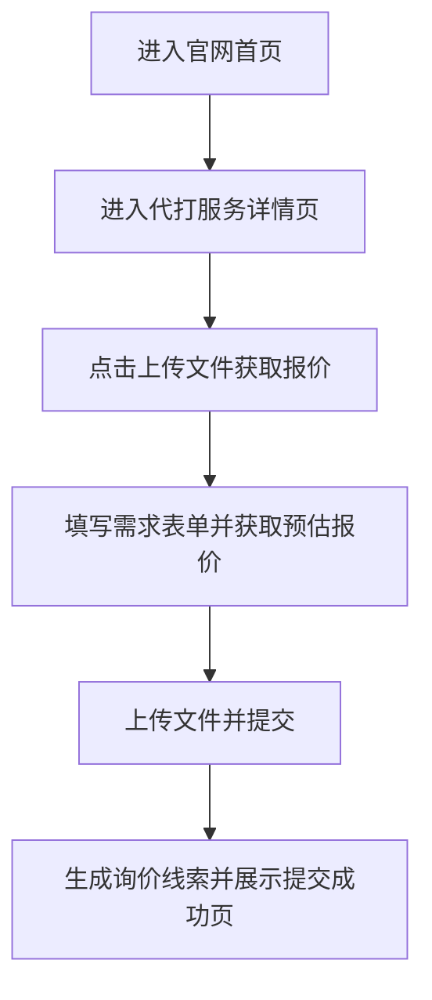
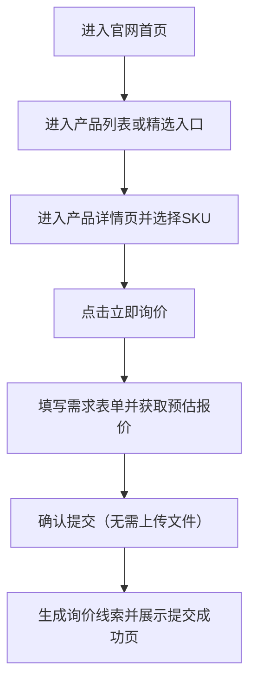
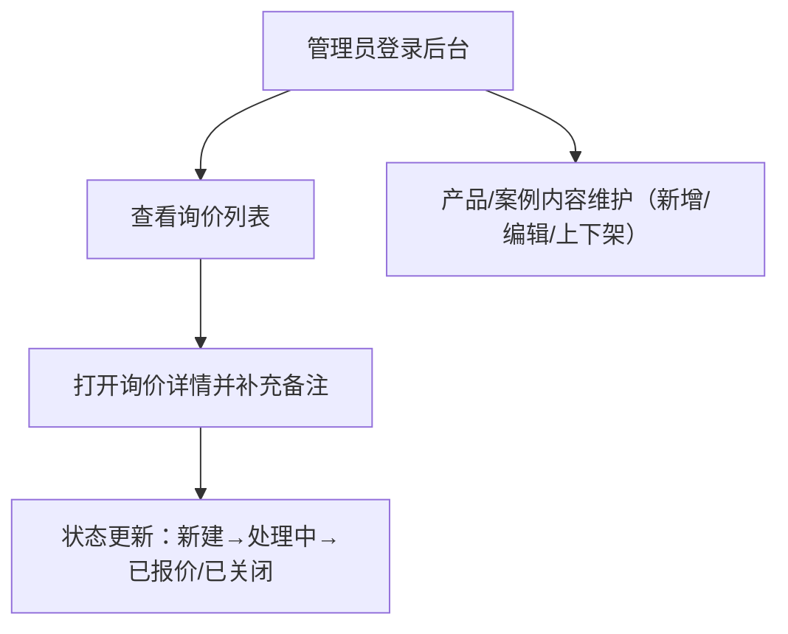

## 1. 产品概述
为3D打印项目提供一个“对外宣传展示 + 对内产品管理”的网页平台，覆盖产品陈列、能力与工艺说明、客户询价收集（含附件与预估报价）、后台内容维护与线索跟进，帮助提升转化与运营效率。
- 目标用户：潜在客户/采购/设计师（浏览与询价）、内部运营人员（维护产品与内容、处理询价）
- 产品价值：更专业的品牌展示、更清晰的产品与工艺信息、更可追踪的询价线索与产品内容管理

## 2. 核心功能

### 2.1 用户角色
| 角色 | 登录/注册方式 | 核心权限 |
|------|--------------|----------|
| 访客（未登录） | 无 | 浏览公开页面、提交询价/联系表单 |
| 管理员 | 邮箱+密码登录 | 产品/案例/素材/页面内容管理、询价管理、基础设置 |

### 2.2 功能模块（页面级）
1. **官网首页**：品牌主视觉、核心能力/工艺速览、精选产品/案例、行动入口（询价/联系）
2. **代打服务详情**：服务说明、交付与能力边界、报价影响因素、上传文件引导、行动入口（获取报价）
3. **产品与案例库**：列表筛选、详情页、SKU与规格参数、参考价格/价格区间展示、应用场景、图片/视频/3D预览（可选）
4. **询价/联系**：两条询价路径（代打服务/平台产品），报价预估（规则可配置）、提交成功回执与后续说明
5. **后台管理**：登录、仪表盘、产品与SKU管理、案例管理、媒体素材库、询价管理（含状态与跟进）、报价规则与站点设置

### 2.3 页面详情
| 页面名称 | 模块名称 | 功能说明 |
|---------|----------|----------|
| 官网首页 | 顶部导航 | Logo、主导航（产品/案例、能力工艺、询价联系）、CTA按钮、语言切换（可选） |
| 官网首页 | 首屏主视觉 | 大标题+一句价值主张、关键能力标签（尺寸/精度/交期/材料）、滚动提示与动效 |
| 官网首页 | 能力与工艺速览 | 工艺类型卡片（FDM/SLA/SLS/金属等可配置）、材料与后处理、质量保障说明 |
| 官网首页 | 精选展示 | 置顶产品/案例卡片、点击进入详情、支持手动配置展示顺序 |
| 官网首页 | 转化区块 | “获取报价/咨询”表单入口、承诺信息（响应时间/隐私说明） |
| 代打服务详情 | 服务说明 | 服务范围、可承接工艺/材料、尺寸与精度能力、交付周期、质量保障、常见问题 |
| 代打服务详情 | 报价影响因素 | 材料/工艺/精度/体积或尺寸/数量/交期/后处理等影响因素说明与示例 |
| 代打服务详情 | 行动按钮 | “上传文件获取报价”“联系咨询” |
| 产品与案例库 | 列表筛选 | 按SKU类别/用途/价格区间/交期标签筛选；支持搜索（名称/SKU/关键词） |
| 产品与案例库 | 列表展示 | 卡片网格、主图、关键参数摘要（尺寸/材料/工艺）、状态标签（新品/热卖） |
| 产品详情/案例详情 | 媒体展示 | 图片画廊、视频（可选）、3D模型预览（可选：glb/stl） |
| 产品详情/案例详情 | 参数与说明 | 规格参数表、工艺与材料说明、应用场景、交期与注意事项、相关产品推荐 |
| 产品详情/案例详情 | 行动按钮 | “立即询价”“下载资料（可选）”“收藏（可选）” |
| 询价/联系 | 询价类型选择 | 两种入口：代打服务（需要文件）/平台产品（选择SKU，不需要文件） |
| 询价/联系 | 需求表单 | 基础信息（姓名/邮箱/电话/公司）、需求（用途/数量/材料/颜色/精度）、交期、备注 |
| 询价/联系 | 报价预估 | 基于“材料/工艺/精度/体积或尺寸/数量/交期”的规则给出预估区间；提示“仅供参考”与影响因子 |
| 询价/联系 | 文件上传（代打必填） | 上传stl/step/zip/pdf等；限制大小与类型；失败重试与隐私提示 |
| 询价/联系 | 提交成功页 | 线索编号、预计响应时间、补充信息入口（可选）、邮件回执（可选） |
| 后台管理 | 登录 | 管理员登录、忘记密码（可选）、登录态保持 |
| 后台管理 | 仪表盘 | 关键指标：本周询价量、未处理询价、热门产品、最近更新 |
| 后台管理 | 产品与SKU管理 | 产品CRUD、SKU（规格/属性/参考价/可选库存）、上下架、排序、标签、参数模板、媒体上传、SEO字段（标题/描述） |
| 后台管理 | 案例管理 | CRUD、置顶、关联产品、媒体与文案 |
| 后台管理 | 素材库 | 图片/视频/3D文件管理、复用与引用、删除保护（被引用提示） |
| 后台管理 | 询价管理 | 线索列表、状态流转（新建/处理中/已报价/已关闭）、预估价/实际报价记录（可选）、导出CSV、备注与跟进记录 |
| 后台管理 | 报价规则 | 材料/工艺/精度/数量/交期的加价系数与阶梯规则；规则版本与生效范围（可选） |
| 后台管理 | 站点设置 | 导航配置、首页区块开关与排序、联系信息、社媒链接、公告栏（可选） |

## 3. 核心流程
### 3.1 访客浏览与询价
访客的询价流程分为两条路径：代打服务（上传文件获取报价）与平台产品（选SKU询价，不需要上传文件）。

#### 3.1.1 代打服务（需要上传文件）
访客从导航/首页CTA进入代打服务详情页，了解服务能力与交付说明后，点击“上传文件获取报价”，填写需求；系统基于规则给出预估报价区间（仅供参考），访客上传文件并提交；系统生成线索并提示预计响应时间。

#### 3.1.2 平台产品（不需要上传文件）
访客从首页/列表进入产品详情页，选择SKU规格并查看参考价说明后，点击“立即询价”，填写需求；系统基于规则给出预估报价区间（仅供参考），访客确认后直接提交；系统生成线索并提示预计响应时间。

### 3.2 管理员维护与跟进
管理员登录后台，维护产品与案例内容；对新询价进行分配/备注/状态更新，必要时导出线索并进行线下沟通。

## 4. 用户界面设计
### 4.1 设计风格
- 主色：深色工业灰/黑（背景）+ 金属质感中性色（卡片）+ 高饱和强调色（电蓝/荧光橙二选一）
- 字体：标题使用具有工程感的展示字体（偏窄体/几何体），正文使用清晰易读的无衬线；中英文混排优化（字重与行高）
- 布局：桌面优先；大留白+硬朗栅格；关键CTA在首屏与详情页固定可见区域
- 组件风格：硬边圆角（4–10px）、细描边、轻微内阴影/高光，营造“设备面板/仪表盘”质感
- 动效：首屏分段入场、滚动触发的内容揭示、卡片悬停的微动与光泽扫过；避免花哨堆砌
- 图标风格：线性工程图标体系（统一描边、少量填充），避免多风格混用

### 4.2 页面设计概览
| 页面名称 | 模块名称 | UI要素 |
|---------|----------|--------|
| 官网首页 | 首屏主视觉 | 大字号标题、工艺能力标签云、背景纹理（网格/噪点/等高线）、CTA高对比按钮 |
| 产品与案例库 | 列表筛选 | 左侧筛选（桌面）/抽屉筛选（移动）、筛选项支持多选与一键清空、结果数提示 |
| 详情页 | 媒体展示 | 大图画廊+缩略图；3D预览入口（可选）；支持全屏查看 |
| 详情页 | 参数表 | 双列表格（名称/值），支持单位与公差说明；关键参数置顶高亮 |
| 询价页 | 表单 | 分组表单、即时校验、隐私提示、上传进度条、提交后明确反馈与下一步说明 |
| 后台管理 | 仪表盘 | 信息密度更高的卡片与图表（轻量），快捷入口（新增产品/查看新询价） |

### 4.3 响应式与适配
- 桌面优先设计；移动端采用单列布局与抽屉导航，关键CTA固定在底部安全区域
- 图片与媒体自适应裁切；列表支持懒加载/分页；表格在移动端转为分组卡片展示
- 表单输入针对触控优化（输入类型、间距、可点击区域），文件上传提供“从相册/文件”入口

### 4.4 3D场景指导（可选）
- 目标：用于展示单个打印件或结构件的交互预览，增强“可制造性/细节”感知
- 灯光：三点布光（主光+辅光+轮廓光），适度环境光与轻微高光，避免过曝
- 相机：默认45°斜俯视；支持轨道旋转与缩放；提供“一键复位”
- 材质：提供基础塑料/树脂/金属三类材质预设；支持粗糙度与法线细节
- 性能预算：单模型面数与纹理大小设定上限；移动端自动降级（关闭后处理/降低分辨率）

## 5. 非功能性需求
- 性能：首屏加载快；媒体资源按需加载；列表与详情有骨架屏与占位状态
- 可用性：错误提示明确；后台操作有确认与撤销（可选）；关键操作有状态反馈
- 安全：后台必须鉴权；上传文件校验类型与大小；敏感信息不在前端明文存储
- SEO：公开页面支持可配置的标题/描述/开放图；产品详情具备可分享链接

## 6. 运营与内容规范
- 内容结构：产品以SKU维度管理（产品主信息+SKU规格/属性/参考价/可选库存）；案例支持关联产品与标签
- 媒体规范：主图比例建议（如16:9或4:3）、统一背景与光线；允许对比图（原型→成品）
- 标签体系：工艺、材料、行业、用途、后处理、精度等级（均可在后台配置）
