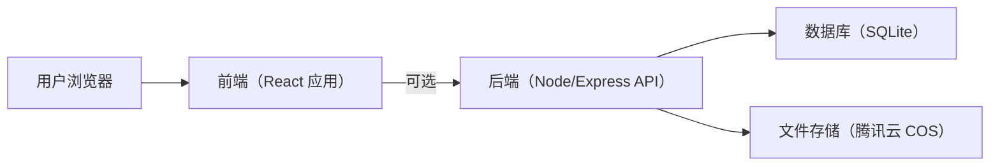
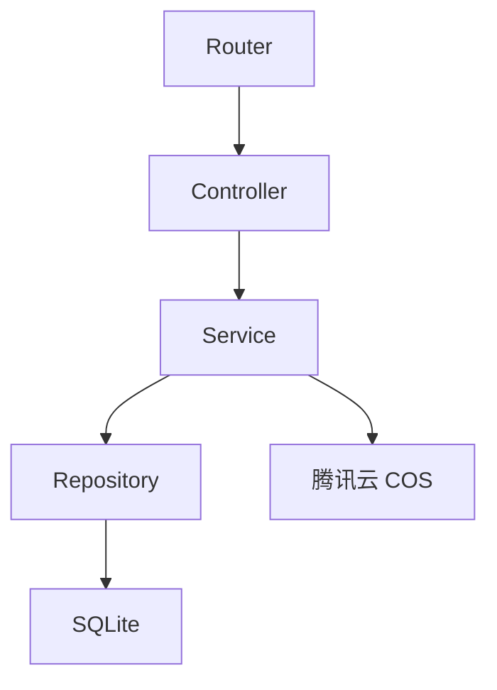
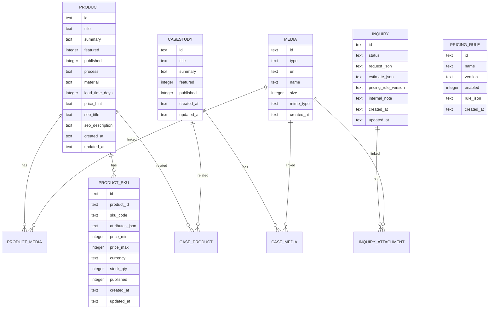

## 1. 架构设计
平台分为“公开官网（展示+询价）”与“后台管理（内容与线索管理）”。默认采用轻量可部署的单体架构：前端应用 + 可选后端API + 数据存储。



## 2. 技术选型说明
- 前端：React@18 + TypeScript + Vite
- 样式：tailwindcss@3（配合CSS变量实现主题与品牌视觉）
- 状态与请求：优先使用React内置能力（Context/Reducer）+ 原生fetch；如复杂再引入轻量库（后续再评估）
- 表单：前端实现基础校验；如后续需要复杂规则再引入表单库（后续再评估）
- 3D预览（可选）：three + @react-three/fiber + @react-three/drei（必要时再加入后处理）
- 后端（建议启用以支持“管理+持久化”）：Node.js + Express
- 数据库：SQLite（单机部署简单）；未来可平滑替换为PostgreSQL
- 文件上传：使用腾讯云 COS 存储文件；后端仅负责签发上传凭证/回调入库与权限控制
- 生产环境：Ubuntu（腾讯云轻量/云服务器均可），Nginx 作为反向代理与静态资源托管，Node 进程使用 PM2/systemd 守护

### 2.1 页面模式（白天/黑夜/跟随系统）
- 实现方式：Tailwind `darkMode: "class"` + 在 `<html>` 上切换 `dark` class
- 三档：`light | dark | system`
- 规则：
  - `system`：读取 `prefers-color-scheme` 实时决定是否加 `dark` class
  - `light/dark`：强制覆盖系统
- 持久化：localStorage 保存用户选择；前台与后台共用一套存储键

## 3. 路由定义
| 路由 | 用途 |
|------|------|
| / | 官网首页 |
| /service/print | 代打服务详情页 |
| /work | 产品与案例库（列表） |
| /work/:id | 产品/案例详情 |
| /quote | 询价/联系 |
| /admin | 后台入口（重定向到登录或仪表盘） |
| /admin/login | 管理员登录 |
| /admin/dashboard | 仪表盘 |
| /admin/products | 产品管理 |
| /admin/products/new | 新增产品 |
| /admin/products/:id/edit | 编辑产品 |
| /admin/cases | 案例管理 |
| /admin/media | 素材库 |
| /admin/inquiries | 询价管理 |
| /admin/inquiries/:id | 询价详情 |
| /admin/pricing | 报价规则 |
| /admin/settings | 站点设置 |

## 4. API 定义（启用后端时）

### 4.1 鉴权
| API | 方法 | 说明 |
|-----|------|------|
| /api/auth/login | POST | 管理员登录，返回访问令牌 |
| /api/auth/me | GET | 获取当前登录用户信息 |
| /api/auth/logout | POST | 退出登录（可选） |

#### 类型定义（TypeScript）
```ts
export type AdminUser = {
  id: string
  email: string
  name: string
}

export type AuthLoginRequest = {
  email: string
  password: string
}

export type AuthLoginResponse = {
  token: string
  user: AdminUser
}
```

### 4.2 产品/案例
| API | 方法 | 说明 |
|-----|------|------|
| /api/products | GET | 公开列表（支持分页、筛选、搜索） |
| /api/products/:id | GET | 公开详情 |
| /api/admin/products | POST | 新增产品（鉴权） |
| /api/admin/products/:id | GET | 后台产品详情（鉴权，含 SKU/媒体信息） |
| /api/admin/products/:id | PATCH | 更新产品（鉴权） |
| /api/admin/products/:id | DELETE | 删除产品（鉴权） |
| /api/admin/products/:id/skus | POST | 新增 SKU（鉴权） |
| /api/admin/products/:id/skus/:skuId | PATCH | 更新 SKU（鉴权） |
| /api/admin/products/:id/skus/:skuId | DELETE | 删除 SKU（鉴权） |
| /api/admin/products/:id/media | POST | 关联媒体到产品（鉴权） |
| /api/admin/products/:id/media/:mediaId | PATCH | 更新产品媒体排序/封面（鉴权） |
| /api/admin/products/:id/media/:mediaId | DELETE | 移除产品媒体关联（鉴权） |
| /api/cases | GET | 公开案例列表 |
| /api/cases/:id | GET | 公开案例详情 |
| /api/admin/cases | POST | 新增案例（鉴权） |
| /api/admin/cases/:id | PATCH | 更新案例（鉴权） |
| /api/admin/cases/:id | DELETE | 删除案例（鉴权） |

#### 类型定义（TypeScript）
```ts
export type MediaAsset = {
  id: string
  type: "image" | "video" | "model3d" | "file"
  url: string
  name: string
  size?: number
  mimeType?: string
}

export type WorkTag = {
  id: string
  name: string
  group: "工艺" | "材料" | "行业" | "用途" | "后处理" | "精度等级"
}

export type ProductSku = {
  id: string
  productId: string
  skuCode: string
  attributes: Record<string, string>
  priceMin?: number
  priceMax?: number
  currency?: "CNY" | "USD"
  stockQty?: number
  published: boolean
  createdAt: string
  updatedAt: string
}

export type Product = {
  id: string
  title: string
  summary: string
  coverAssetId?: string
  galleryAssetIds: string[]
  tags: WorkTag[]
  process?: string
  material?: string
  leadTimeDays?: number
  priceHint?: string
  skus: ProductSku[]
  featured: boolean
  published: boolean
  seoTitle?: string
  seoDescription?: string
  createdAt: string
  updatedAt: string
}

export type CaseStudy = {
  id: string
  title: string
  summary: string
  galleryAssetIds: string[]
  relatedProductIds: string[]
  tags: WorkTag[]
  published: boolean
  featured: boolean
  createdAt: string
  updatedAt: string
}
```

### 4.3 询价线索
| API | 方法 | 说明 |
|-----|------|------|
| /api/quote/estimate | POST | 公开获取预估报价区间（不落库） |
| /api/inquiries | POST | 公开提交询价 |
| /api/admin/inquiries | GET | 后台查询线索（鉴权） |
| /api/admin/inquiries/:id | GET | 线索详情（鉴权） |
| /api/admin/inquiries/:id | PATCH | 更新状态/备注（鉴权） |
| /api/admin/inquiries/:id | DELETE | 删除/归档（鉴权，可选） |
| /api/admin/inquiries/export | GET | 导出CSV（鉴权，可选） |

#### 类型定义（TypeScript）
```ts
export type InquiryStatus = "new" | "processing" | "quoted" | "closed"

export type QuoteEstimateRequest = {
  skuId?: string
  quantity?: number
  processPreference?: string
  materialPreference?: string
  precisionPreference?: string
  leadTimePreference?: string
  modelMetrics?: {
    volumeCm3?: number
    boundingBoxMm?: { x: number; y: number; z: number }
  }
}

export type QuoteEstimateResponse = {
  currency: "CNY" | "USD"
  priceMin: number
  priceMax: number
  ruleVersion?: string
  disclaimer: string
}

export type InquiryCreateRequest = {
  name: string
  email: string
  phone?: string
  company?: string
  useCase?: string
  quantity?: number
  materialPreference?: string
  processPreference?: string
  precisionPreference?: string
  leadTimePreference?: string
  notes?: string
  attachmentAssetIds?: string[]
  quoteEstimate?: QuoteEstimateResponse
}

export type Inquiry = {
  id: string
  status: InquiryStatus
  request: InquiryCreateRequest
  internalNote?: string
  createdAt: string
  updatedAt: string
}
```

### 4.4 报价规则
| API | 方法 | 说明 |
|-----|------|------|
| /api/admin/pricing | GET | 规则列表（鉴权） |
| /api/admin/pricing | POST | 新增规则（鉴权） |
| /api/admin/pricing/:id | PATCH | 更新规则（鉴权） |
| /api/admin/pricing/:id | DELETE | 删除规则（鉴权） |
| /api/admin/pricing/:id/enable | POST | 启用指定规则（鉴权，通常启用后自动禁用其他规则） |

### 4.5 媒体与上传
| API | 方法 | 说明 |
|-----|------|------|
| /api/uploads/presign | POST | 访客上传附件前置：签发 COS 直传凭证（公开，带限流/校验） |
| /api/admin/media/presign | POST | 后台上传素材前置：签发 COS 直传凭证（鉴权） |
| /api/admin/media | POST | 创建素材记录（鉴权，写入文件元信息与 COS Key） |
| /api/media/:id | GET | 获取素材访问信息（公开/或按需鉴权，返回可访问URL或临时URL） |
| /api/admin/media/:id | DELETE | 删除素材（鉴权，可选：同时删除COS对象） |

#### 上传限制（建议默认值，可配置）
- 单文件大小上限：200MB（通过环境变量配置）
- 允许类型（示例）：stl、step、stp、obj、glb、zip、pdf、png、jpg、jpeg
- 校验点：后端签发凭证时校验文件扩展名/MIME/大小；COS 侧可配置存储桶策略与生命周期

## 5. 服务端架构图（启用后端时）


## 6. 数据模型
### 6.1 数据模型定义（ER）


### 6.2 数据定义语言（DDL，SQLite）
```sql
CREATE TABLE IF NOT EXISTS admin_user (
  id TEXT PRIMARY KEY,
  email TEXT NOT NULL UNIQUE,
  name TEXT NOT NULL,
  password_hash TEXT NOT NULL,
  created_at TEXT NOT NULL
);

CREATE TABLE IF NOT EXISTS product (
  id TEXT PRIMARY KEY,
  title TEXT NOT NULL,
  summary TEXT NOT NULL,
  process TEXT,
  material TEXT,
  lead_time_days INTEGER,
  price_hint TEXT,
  featured INTEGER NOT NULL DEFAULT 0,
  published INTEGER NOT NULL DEFAULT 0,
  seo_title TEXT,
  seo_description TEXT,
  created_at TEXT NOT NULL,
  updated_at TEXT NOT NULL
);

CREATE TABLE IF NOT EXISTS product_sku (
  id TEXT PRIMARY KEY,
  product_id TEXT NOT NULL,
  sku_code TEXT NOT NULL,
  attributes_json TEXT NOT NULL DEFAULT '{}',
  price_min INTEGER,
  price_max INTEGER,
  currency TEXT NOT NULL DEFAULT 'CNY',
  stock_qty INTEGER,
  published INTEGER NOT NULL DEFAULT 0,
  created_at TEXT NOT NULL,
  updated_at TEXT NOT NULL,
  FOREIGN KEY (product_id) REFERENCES product(id)
);

CREATE UNIQUE INDEX IF NOT EXISTS idx_product_sku_code ON product_sku(sku_code);
CREATE INDEX IF NOT EXISTS idx_product_sku_product_id ON product_sku(product_id);

CREATE TABLE IF NOT EXISTS case_study (
  id TEXT PRIMARY KEY,
  title TEXT NOT NULL,
  summary TEXT NOT NULL,
  featured INTEGER NOT NULL DEFAULT 0,
  published INTEGER NOT NULL DEFAULT 0,
  created_at TEXT NOT NULL,
  updated_at TEXT NOT NULL
);

CREATE TABLE IF NOT EXISTS media (
  id TEXT PRIMARY KEY,
  type TEXT NOT NULL,
  url TEXT NOT NULL,
  name TEXT NOT NULL,
  size INTEGER,
  mime_type TEXT,
  created_at TEXT NOT NULL
);

CREATE TABLE IF NOT EXISTS product_media (
  product_id TEXT NOT NULL,
  media_id TEXT NOT NULL,
  sort_order INTEGER NOT NULL DEFAULT 0,
  PRIMARY KEY (product_id, media_id),
  FOREIGN KEY (product_id) REFERENCES product(id),
  FOREIGN KEY (media_id) REFERENCES media(id)
);

CREATE TABLE IF NOT EXISTS case_media (
  case_id TEXT NOT NULL,
  media_id TEXT NOT NULL,
  sort_order INTEGER NOT NULL DEFAULT 0,
  PRIMARY KEY (case_id, media_id),
  FOREIGN KEY (case_id) REFERENCES case_study(id),
  FOREIGN KEY (media_id) REFERENCES media(id)
);

CREATE TABLE IF NOT EXISTS case_product (
  case_id TEXT NOT NULL,
  product_id TEXT NOT NULL,
  PRIMARY KEY (case_id, product_id),
  FOREIGN KEY (case_id) REFERENCES case_study(id),
  FOREIGN KEY (product_id) REFERENCES product(id)
);

CREATE TABLE IF NOT EXISTS inquiry (
  id TEXT PRIMARY KEY,
  status TEXT NOT NULL,
  request_json TEXT NOT NULL,
  estimate_json TEXT,
  pricing_rule_version TEXT,
  internal_note TEXT,
  created_at TEXT NOT NULL,
  updated_at TEXT NOT NULL
);

CREATE TABLE IF NOT EXISTS inquiry_attachment (
  inquiry_id TEXT NOT NULL,
  media_id TEXT NOT NULL,
  PRIMARY KEY (inquiry_id, media_id),
  FOREIGN KEY (inquiry_id) REFERENCES inquiry(id),
  FOREIGN KEY (media_id) REFERENCES media(id)
);

CREATE TABLE IF NOT EXISTS pricing_rule (
  id TEXT PRIMARY KEY,
  name TEXT NOT NULL,
  version TEXT NOT NULL,
  enabled INTEGER NOT NULL DEFAULT 1,
  rule_json TEXT NOT NULL,
  created_at TEXT NOT NULL
);

CREATE UNIQUE INDEX IF NOT EXISTS idx_pricing_rule_version ON pricing_rule(version);
```

## 7. 部署与服务器配置（Ubuntu + Nginx + PM2 + 腾讯云 COS）

### 7.1 部署形态
- Nginx：对外提供 80/443，托管前端静态文件，并反向代理 `/api/` 到 Node
- Node/Express：提供鉴权、业务API、签发 COS 直传凭证、写入 SQLite 数据
- SQLite：本机文件存储（建议单独目录+备份）
- COS：存储访客附件、后台素材与可选3D模型文件

### 7.2 目录建议
- /opt/print-site/app（后端应用与依赖）
- /opt/print-site/web（前端构建产物）
- /opt/print-site/data（SQLite 数据库与备份临时文件）
- /opt/print-site/logs（应用日志，可选）

### 7.3 Nginx 配置要点（示例）
```nginx
server {
  listen 80;
  server_name example.com;

  root /opt/print-site/web;
  index index.html;

  location /api/ {
    proxy_pass http://127.0.0.1:3000/;
    proxy_set_header Host $host;
    proxy_set_header X-Real-IP $remote_addr;
    proxy_set_header X-Forwarded-For $proxy_add_x_forwarded_for;
    proxy_set_header X-Forwarded-Proto $scheme;
  }

  location / {
    try_files $uri /index.html;
  }
}
```

### 7.4 Node 进程守护（PM2）
```bash
pm2 start dist/server.js --name print-site-api --time
pm2 save
pm2 startup
```

### 7.5 环境变量（示例）
- APP_BASE_URL：站点域名（用于生成回调链接/跳转链接）
- PORT：后端端口（建议 3000）
- DB_PATH：SQLite 文件路径（如 /opt/print-site/data/app.sqlite）
- JWT_SECRET：管理员登录令牌密钥
- UPLOAD_MAX_BYTES：单文件大小限制（默认 209715200）
- COS_BUCKET / COS_REGION：COS 存储桶与地域
- COS_SECRET_ID / COS_SECRET_KEY：COS 访问凭证（建议使用更安全的临时凭证体系或最小权限子账号）

### 7.5.1 前端环境变量（示例）
- VITE_API_BASE_URL：可选，当前端与后端分离部署时使用（如 https://api.example.com）。不配置则默认同域 `/api/*`

### 7.6 文件上传到 COS 的推荐流程（直传）
1. 前端提交文件元信息（文件名、大小、类型）到 `/api/uploads/presign` 或 `/api/admin/media/presign`
2. 后端校验大小与类型，通过后返回 COS 直传所需字段（或临时URL/签名）
3. 前端将文件直接上传到 COS
4. 前端提交上传结果（COS Key/ETag/URL）到后端，后端创建 media 记录并用于后续引用

### 7.7 备份建议
- 每日备份 SQLite（/opt/print-site/data/app.sqlite）到 COS（建议版本化路径）
- 关键配置与规则（报价规则 JSON）可随数据库备份或单独导出
